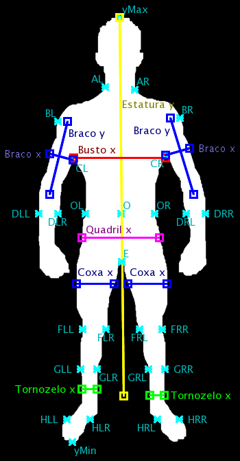
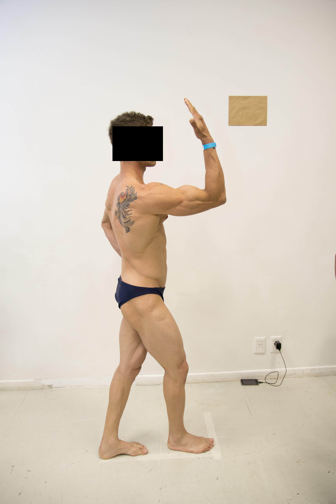
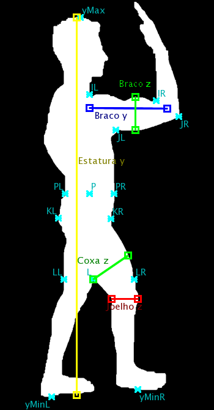

# Body Measurement

An automatic approach to measure body parts both from the front- and side-views of the person.

Such technique can be beneficial in fields such as healthcare, fitness, fashion, and ergonomics. In healthcare, precise measurements are crucial for diagnosing and monitoring conditions, as well as customizing treatments and prosthetics. Fitness enthusiasts could use such an algorithm to accurately track their progress and tailor workout routines to specific body proportions. In the fashion industry, automated measurements could revolutionize online shopping by providing accurate sizing information, reducing returns and improving customer satisfaction. Additionally, in ergonomics, precise measurements can enhance workplace design to promote comfort and prevent injuries. Overall, an algorithm capable of automatically measuring body parts can streamline processes, improve accuracy, and enhance user experience across multiple domains.
